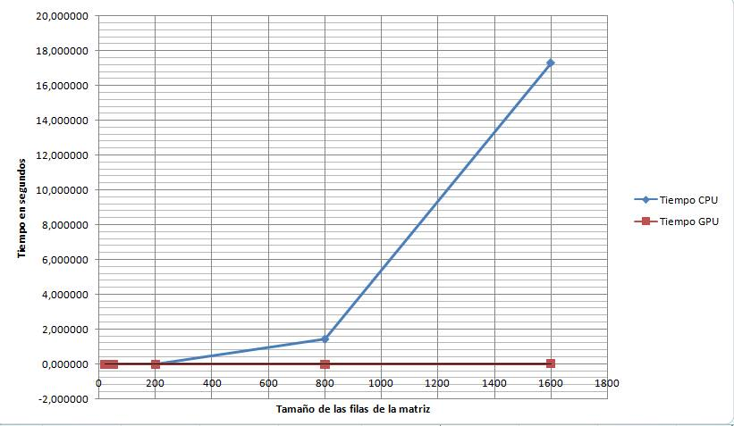
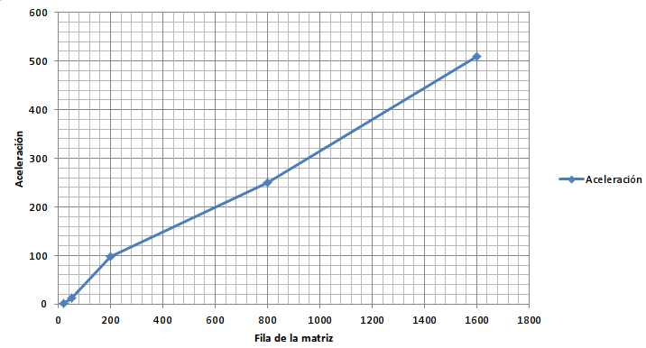

#Comparacion entre una implementacion secuencial (CPU), y una paralela usando Shared Memory (CUDA) para multiplicar 2 matrices

Se implemento una operación de multiplicación de matrices en CUDA de forma secuencial y con memoria compartida por medio del uso de TILES,
posteriormente se probaron dichas implementaciones con diferentes tamaños de matrices y de TILES. Se tomaron muestras de tiempos para verificar la aceleración
que era obtenida al correr los algoritmos y a continuación se muestran los resultados:

## Información primera multiplicación de matrices

| Row M1 | Col M1 | Row M2 | Col M2 | TILES | BLOCKSIZE |
|----|----|----|----|-------|-----------|
| 20 | 20 | 20 | 21 |   4   |     4     |

### Tiempos

|Time CPU (s)|Time GPU (s)|
|--------|--------|
|0,000031|0,000047|
|0,000065|0,000047|
|0,000064|0,000047|
|0,000064|0,000046|
|0,000028|0,000046|
|0,000027|0,000047|
|0,000065|0,000047|
|0,000037|0,000047|
|0,000067|0,000047|
|0,000027|0,000046|
|0,000028|0,000047|
|Promedio|Promedio|
|0,000046|0,000047|

## Información segunda multiplicación de matrices

| Row M1 | Col M1 | Row M2 | Col M2 | TILES | BLOCKSIZE |
|----|----|----|----|-------|-----------|
| 50 | 100 | 100 | 50 |   4   |     4     |

### Tiempos

|Time CPU (s)|Time GPU (s)|
|--------|--------|
|0,000750|0,000074|
|0,000673|0,000074|
|0,000701|0,000073|
|0,000736|0,000073|
|0,001020|0,000073|
|0,000877|0,000079|
|0,000673|0,000073|
|0,001605|0,000074|
|0,000946|0,000073|
|0,001615|0,000077|
|0,000860|0,000074|
|Promedio|Promedio|
|0,000951|0,000074|

## Información tercera multiplicación de matrices

| Row M1 | Col M1 | Row M2 | Col M2 | TILES | BLOCKSIZE |
|----|----|----|----|-------|-----------|
|200 |200 |200 |180 |   8   |     8     |

### Tiempos

|Time CPU (s)|Time GPU (s)|
|--------|--------|
|0,023564|0,000243|
|0,021858|0,000254|
|0,024782|0,000243|
|0,026409|0,000255|
|0,022347|0,000244|
|0,024806|0,000246|
|0,022821|0,000245|
|0,025080|0,000247|
|0,026479|0,000244|
|0,023449|0,000245|
|Promedio|Promedio|
|0,024160|0,000247|

## Información cuarta multiplicación de matrices

| Row M1 | Col M1 | Row M2 | Col M2 | TILES | BLOCKSIZE |
|----|----|----|----|-------|-----------|
|800 |800 |800 |700 |   16  |     16    |

### Tiempos

|Time CPU (s)|Time GPU (s)|
|--------|--------|
|1,469576|0,005793|
|1,474436|0,005793|
|1,470201|0,005797|
|1,468023|0,005769|
|1,471147|0,005769|
|1,465139|0,005814|
|1,469319|0,005781|
|1,254906|0,005825|
|1,469349|0,005794|
|1,469112|0,005808|
|Promedio|Promedio|
|1,448121|0,005794|

## Información quinta multiplicación de matrices

| Row M1 | Col M1 | Row M2 | Col M2 | TILES | BLOCKSIZE |
|----|----|----|----|-------|-----------|
|1600|1600|1600|1500|   32  |     32    |

### Tiempos

|Time CPU (s)|Time GPU (s)|
|--------|---------|
|16,834443|0,033893|
|17,382090|0,033851|
|17,130070|0,033661|
|16,674025|0,033876|
|18,584216|0,034155|
|16,527862|0,034231|
|16,603466|0,033910|
|17,457718|0,033882|
|17,510933|0,033900|
|18,355593|0,034415|
|Promedio |Promedio|
|17,306042|0,033977|

# Gráfica Comparativa de tiempos

|Matrix (Row) |Time CPU (s) |	Time GPU (s)| Acceleration|
|-------|-----------|-----------|-----------|
|20	    |0,000046	  |0,000047|0,978599222|
|50	    |0,000951	  |0,000074|12,79804162|
|200	  |0,0241595 |0,0002466|97,9703974|
|800	  |1,4481208 |0,0057943|249,9216126|
|1600	  |17,3060416 |0,03397735|509,3405342|

## Gráfica de Aceleración

# Conclusiones

+ En conclucion vemos que a medida que aumenta el tamaño de las matrices las operaciones en cpu se hacen exponencialmente mas lentas, mientras que las operaciones en GPU con memoria compartida mantienen la velocidad en las operaciones de forma lineal por lo cual hay una aceleracion cuando se comparan con las operaciones realizadas en CPU, esta aceleracion se hace mas visible con matrices de gran tamaño.

+ Se tuvieron algunos problemas al calcular el tamaño que debian tener los TILES para obtener los resultados deseados cosa que nos retrazo un poco el trabajo, por lo cual se debe ser cuidadosos al momento de asignar el tamaño de los TILES y el BLOCKSIZE ya que estos afectan el resultado de las operaciones.
